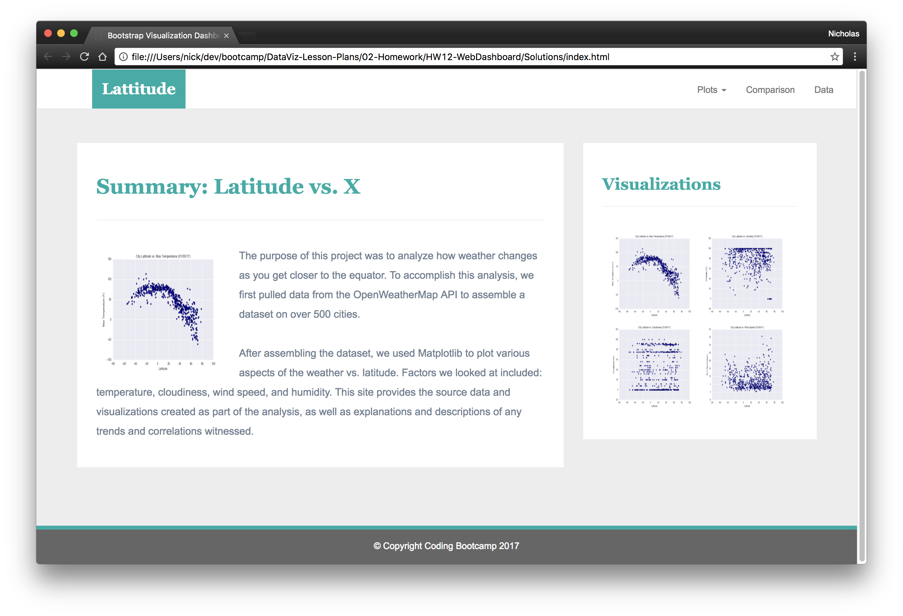

# Latitude Web Page

I completed this project during my time at the [Columbia Engineering Data Analytics Bootcamp](https://bootcamp.cvn.columbia.edu/data/nyc/landing/?s=Google-Brand&pkw=%2Bdata%20%2Banalytics%20%2Bcolumbia&pcrid=392444639754&pmt=b&utm_source=google&utm_medium=cpc&utm_campaign=%5BS%5D_GRD_Data_Brand_ALL_NYC_BMM_New&utm_term=%2Bdata%20%2Banalytics%20%2Bcolumbia&utm_content=392444639754&s=google&k=%2Bdata%20%2Banalytics%20%2Bcolumbia&gclid=Cj0KCQiA2b7uBRDsARIsAEE9XpFH-2wU0-_7jtxCV_PCkGBR0prlyKtvpF2-nAWU1tO4oYci5h1QStsaAsg5EALw_wcB&gclsrc=aw.ds) located in New York, NY.

#### -- Project Status: [Completed]

## Project Description

The purpose of this project is to create a visualization dashboard website using visualizations about [weather data](Resources/cities.csv).

The dashboard includes the following: 

* A landing page containing with a project description and links to each visualization page

* Four visualization pages with a descriptive title and heading tag.
  * The plot/visualization itself for the selected comparison.
  * A paragraph describing the plot and its significance.
* A "Comparisons" page that:
  * Contains all of the visualizations on the same page so we can easily visually compare them.
  * Uses a bootstrap grid for the visualizations.
    * The grid must be two visualizations across on screens medium and larger, and 1 across on extra-small and small screens.
* A "Data" page that:
  * Displays a responsive table containing the data used in the visualizations.
    * The table must be a bootstrap table component.
    * The data must come from exporting the `.csv` file as HTML, or converting it to HTML. You may use a csv-to-html table conversion tool, e.g. [ConvertCSV](http://www.convertcsv.com/csv-to-html.htm).

The website must, at the top of every page, have a navigation menu that:

* Has the name of the site on the left of the nav which allows users to return to the landing page from any page.
* Contains a dropdown on the right of the navbar named "Plots" which provides links to each individual visualization page.
* Provides two more links on the right: "Comparisons" which links to the comparisons page, and "Data" which links to the data page.
* Is responsive (using media queries). The nav must have similar behavior as the screenshots ["Navigation Menu" section](#navigation-menu) (notice the background color change).

Finally, the website must be deployed to GitHub pages.

When finished, submit to BootcampSpot the links to 1) the deployed app and 2) the GitHub repository.

## Methods Used
* Data visualization
* Data exploration
* Web Development

## Technologies
* HTML
* CSS
* Github Pages

## Getting Started

1. Clone this repo (for help see this [tutorial](https://help.github.com/articles/cloning-a-repository/)).
2. Find HTML pages in the [main folder](https://github.com/CarolineDelva/WebVisualizationDashboard-Latitute-HTML-CSS-BootStrap-Project).
3. Find CSS pages in the [main folder](https://github.com/CarolineDelva/WebVisualizationDashboard-Latitute-HTML-CSS-BootStrap-Project).
4. Find the [cities.csv](https://github.com/CarolineDelva/WebVisualizationDashboard-Latitute-HTML-CSS-BootStrap-Project/blob/master/Resources/cities.csv) in the Resources folder.
5. The final page is deployed to Github and a Github Page is created. 

## Output

See the Latitude Dashboard in action: [Latitude]( https://carolinedelva.github.io/WebVisualizationDashboard-Latitute-HTML-CSS-BootStrap-Project/)

#### Landing page

Large screen:

Small screen:

#### Comparisons page

Large screen:

Small screen:

#### Data page

Large screen:

Small screen:

#### Visualization pages

Large screen:

Small screen:

#### Navigation menu

Large screen:

Small screen:

